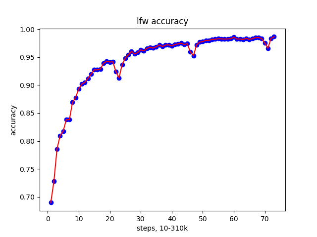

## Insight Face in TensorFlow

#### Tasks
* ~~mxnet dataset to tfrecords~~
* ~~backbone network architectures [vgg16, vgg19, resnet]~~
* ~~backbone network architectures [resnet-se, resnext]~~
* ~~LResNet50E-IR~~
* ~~LResNet100E-IR~~
* ~~Additive Angular Margin Loss~~
* ~~CosineFace Loss~~
* ~~train network code~~
* ~~add validate during training~~
* ~~multi-gpu training~~
* evaluate code

#### Training Logs
```
epoch 0, total_step 20, total loss is 107.34 , inference loss is 80.60, weight deacy loss is 26.74, training accuracy is 0.000000, time 38.373 samples/sec
epoch 0, total_step 40, total loss is 109.65 , inference loss is 77.31, weight deacy loss is 32.34, training accuracy is 0.000000, time 38.281 samples/sec
epoch 0, total_step 60, total loss is 114.86 , inference loss is 82.29, weight deacy loss is 32.57, training accuracy is 0.000000, time 37.687 samples/sec
epoch 0, total_step 80, total loss is 104.92 , inference loss is 72.77, weight deacy loss is 32.15, training accuracy is 0.000000, time 38.402 samples/sec
epoch 0, total_step 100, total loss is 101.66 , inference loss is 69.99, weight deacy loss is 31.67, training accuracy is 0.000000, time 38.235 samples/sec
epoch 0, total_step 120, total loss is 101.70 , inference loss is 70.54, weight deacy loss is 31.16, training accuracy is 0.000000, time 37.822 samples/sec
epoch 0, total_step 140, total loss is 102.23 , inference loss is 71.61, weight deacy loss is 30.63, training accuracy is 0.000000, time 38.308 samples/sec
epoch 0, total_step 160, total loss is 103.26 , inference loss is 73.17, weight deacy loss is 30.08, training accuracy is 0.000000, time 38.054 samples/sec
epoch 0, total_step 180, total loss is 98.61 , inference loss is 69.07, weight deacy loss is 29.54, training accuracy is 0.000000, time 38.198 samples/sec
epoch 0, total_step 200, total loss is 95.20 , inference loss is 66.16, weight deacy loss is 29.04, training accuracy is 0.000000, time 38.217 samples/sec
```


#### Training Tips(Continual updates)
* If you can't use large batch size(>128), you should use small learning rate
* If you can't use large batch size(>128), you can try batch renormalization(file `L_Resnet_E_IR_RBN.py`)
* If use multiple gpus, you should keep at least 16 images each gpu.
* Try [Group Normalization](https://arxiv.org/pdf/1803.08494.pdf), you can use the code `L_Resnet_E_IR_GBN.py`


#### Training models (Continual updates)

##### model A
| model name    | depth| normalization layer |batch size|
| ----- |:-----:|:-----:|:-----:|
| model A | 50 |group normalization|16|

###### 2018-03-28
| dbname    | steps | accuracy |
| ----- |:-----:|:-----:|
| lfw | 170.0k |0.9288|
| cfp_ff | 170.0k |0.914|
| cfp_fp | 170.0k |0.7219|
| age_db30 | 170.0k |0.722|

###### 2018-04-04
| dbname    | steps | accuracy |
| ----- |:-----:|:-----:|
| lfw | 730.0k |0.9865|
| cfp_ff | 730.0k |0.9831|
| cfp_fp | 730.0k |0.8259|
| age_db30 | 730.0k |0.8950|



##### model B
| model name    | depth| normalization layer |batch size|
| ----- |:-----:|:-----:|:-----:|
| model B | 50 |batch normalization|10|

###### 2018-03-30
| dbname    | steps | accuracy |
| ----- |:-----:|:-----:|
| lfw | 30.0k |0.9585
| cfp_ff | 30.0k |0.9547|
| cfp_fp | 30.0k |0.7577|
| age_db30 | 30.0k |0.8553|


###### 2018-04-04
| dbname    | accuracy |
| ----- |:-----:|
| lfw |0.9912|
| cfp_ff |0.9897|
| cfp_fp |0.8539|
| age_db30 |0.9400|

#### Requirements
1. TensorFlow 1.4 1.6
2. TensorLayer 1.7
3. cuda8&cudnn6 or cuda9&cudnn7
4. Python3


#### Max Batch Size Test
###### Environment

| GPU    | cuda| cudnn | TensorFlow |TensorLayer|Maxnet |Gluon|
| ----- |:-----:|:-----:|:------:|:---:|:------:|:---:|
| Titan xp | 9.0 |7.0|1.6|1.7 |1.1.0|1.1.0 |

###### Results

| DL Tools        | Max BatchSize(without bn and prelu)| Max BatchSize(with bn only) | Max BatchSize(with prelu only) |Max BatchSize(with bn and prelu)|
| ------------- |:-------------:|:--------------:|:------------:|:------------:|
| TensorLayer      | (8000, 9000) |(5000, 6000)|(3000, 4000)|(2000, 3000) |
| Mxnet      | (40000, 50000) |(20000, 30000)|(20000, 30000)|(10000, 20000) |
| Gluon      | (7000, 8000) |(3000, 4000)|no official method| None |

> (8000, 9000) : 8000 without OOM, 9000 OOM Error

###### Test Code

|TensorLayer| Maxnet | Gluon |
| ----- |:-----:|:-----:|
| [tensorlayer_batchsize_test.py](https://github.com/auroua/InsightFace_TF/blob/master/test/benchmark/tensorlayer_batchsize_test.py) | [mxnet_batchsize_test.py](https://github.com/auroua/InsightFace_TF/blob/master/test/benchmark/mxnet_batchsize_test.py) |[gluon_batchsize_test.py](https://github.com/auroua/InsightFace_TF/blob/master/test/benchmark/gluon_batchsize_test.py)|


#### pretrained model download link
* [resnet_v1_50](http://download.tensorflow.org/models/resnet_v1_50_2016_08_28.tar.gz)
* [resnet_v1_101](http://download.tensorflow.org/models/resnet_v1_101_2016_08_28.tar.gz)
* [resnet_v1_152](http://download.tensorflow.org/models/resnet_v1_152_2016_08_28.tar.gz)
* [vgg16](http://www.cs.toronto.edu/~frossard/post/vgg16/)
* [vgg19](https://github.com/machrisaa/tensorflow-vgg)


#### References
1. [InsightFace mxnet](https://github.com/deepinsight/insightface)
2. [InsightFace : Additive Angular Margin Loss for Deep Face Recognition](https://arxiv.org/abs/1801.07698)
3. [Group Normalization](https://arxiv.org/pdf/1803.08494.pdf)
3. [tensorlayer_vgg16](https://github.com/tensorlayer/tensorlayer/blob/master/example/tutorial_vgg16.py)
4. [tensorlayer_vgg19](https://github.com/tensorlayer/tensorlayer/blob/master/example/tutorial_vgg19.py)
5. [tf_slim](https://github.com/tensorflow/models/tree/master/research/slim)
6. [Deep Residual Learning for Image Recognition](https://arxiv.org/abs/1512.03385)
7. [Very Deep Convolutional Networks For Large-Scale Image Recognition](https://arxiv.org/abs/1409.1556)
8. [Squeeze-and-Excitation Networks](https://arxiv.org/pdf/1709.01507.pdf)